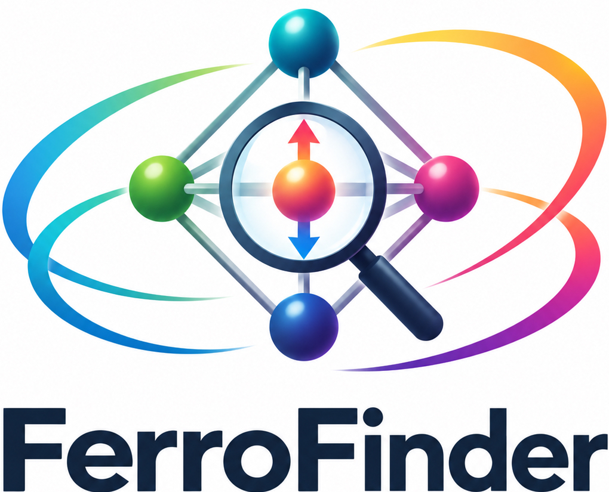

<p align="center">

</p>

# FerroFinder

FerroFinder uses a field-aware MACE-Field model to propose nonpolar-parent
structures and polarization branches from a **polar crystal endpoint alone**.
It generates candidate structures and samples a geometric P → N → −P branch;
it does not claim that the candidate is a relaxed ground state or that the path
is a switching barrier.

## Install

Use Python 3.10 or newer. Install FerroFinder and its numerical dependencies:

```bash
python -m venv .venv
source .venv/bin/activate
python -m pip install --upgrade pip
python -m pip install -e .
```

Install a compatible MACE-Field build separately and obtain a field-aware
checkpoint. The checkpoint and MACE-Field package are not bundled here.
If MACE-Field is available only from a source checkout, pass `--mace-checkout`
to the command. See [installation notes](docs/installation.md).

## Recover a parent candidate

For one periodic CIF or extended XYZ, pass the file and checkpoint:

```bash
ferrofinder polar.cif \
  --model /path/to/MACEField.model \
  --head mp-ferroelectric \
  --relax \
  --output-dir results/polar
```

`--relax` first applies a deterministic 0.01 Å Gaussian rattle, then relaxes
the input with ASE BFGS (default force target 0.05 eV/Å, up to 500 steps).
Variable-cell mode relaxes positions and the full cell with
`FrechetCellFilter`; add `--fixed-cell` to relax positions only. Tune this
step with `--relax-rattle-stdev`, `--relax-fmax`, and `--relax-max-steps`.

The command also accepts a folder of CIF/XYZ files and reads every frame in a
multi-frame XYZ or extended XYZ as a separate polar endpoint. By default each
sampled P → N → −P path has 17 images, with BECs and polarizability evaluated
for every image. For a folder, process materials in parallel with CPU workers:

```bash
ferrofinder polar_cifs/ \
  --model /path/to/MACEField.model \
  --head mp-ferroelectric \
  --output-dir results/screen \
  --workers 8 \
  --num-images 17 \
  --variable-cell
```

A multi-frame extended XYZ can be passed directly:

```bash
ferrofinder endpoints.extxyz \
  --model /path/to/MACEField.model \
  --output-dir results/screen \
  --workers 8
```

A plain XYZ file has no unit cell, so supply its lattice lengths and angles
(Å and degrees). The same cell is applied to every frame:

```bash
ferrofinder polar.xyz \
  --cell 5.6,5.6,7.9,90,90,120 \
  --model /path/to/MACEField.model \
  --output-dir results/polar
```

FerroFinder defaults to bounded variable-cell inverse distortion. For one
structure, the output contains `report.json`, `structures.extxyz`, per-image
response data, and `explorer/index.html`. With `--relax`, it also saves the
rattled-and-relaxed endpoint as `relaxed_input.extxyz`. For multiple
structures, it also contains one `materials/<query_id>/` directory per input,
a top-level `index.html` results table, and a shared explorer that can switch
between recovered branches. Serve the output directory:

```bash
cd results/screen
python -m http.server 8000
```

Open `http://localhost:8000/` for the material table and
`http://localhost:8000/explorer/` for the branch viewer. `--fixed-cell` (or
`--no-variable-cell`) disables the strain-response block during parent
back-projection. `--num-images` sets the total points in the symmetric path;
it must be an odd integer of at least three. `--no-compute-becs` and
`--no-compute-polarizability` skip those all-image calculations. Use
`--resume` to continue an interrupted run with the same inputs, checkpoint,
and settings. See the [user guide](docs/user-guide.md) for input rules and
the other search bounds.

## Scientific limits

These are model-generated structural hypotheses. They require independent
relaxation and higher-level validation before being treated as stable phases.
The sampled interpolation is geometric: it is not a relaxed minimum-energy
path, a coercive field, or an activation barrier. MACE-Field predictions do
not establish that a structure is insulating. The
[method note](docs/method.md) describes the inverse-distortion update and its
assumptions.

FerroFinder is distributed under the [MIT License](LICENSE).
